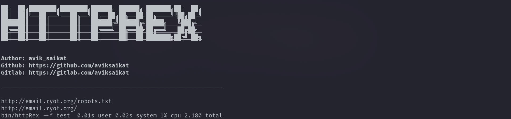
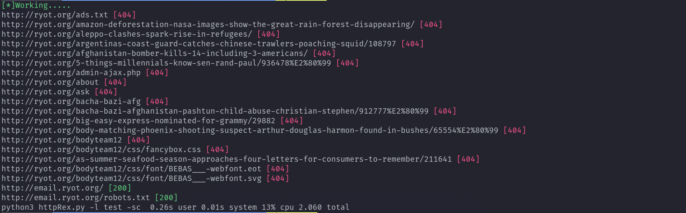

# HTTP🕸️Rex🦖
`httpRex` is a command-line tool for checking the status code of one or multiple URLs. It can also save the output to a file.

> Saikat Karmakar | 7 Mar : 2023


<!-- [](https://goreportcard.com/report/github.com/Aviksaikat/httpRex/) -->


# 🚀 Features

- Check the status code of one or multiple URLs
- Print the status code of each URL with coloured output
- Save the output to a file in either text or JSON format
- It's freaking fast

# 💾 Requirements 
```bash
- Go 1.19.5 or higher
```

# 🤖 Installation 
- Using `go install`
```bash
go install -v github.com/aviksaikat/httpRex@latest
```

- Build from source
```bash
go build httpRex.go
./httpRex
```


# 🛠️ Usage
```bash
httpRex -h
```
This will display help for the tool. Here are all the switches it supports.


```bash
bin/httpRex -h

██╗  ██╗████████╗████████╗██████╗ ██████╗ ███████╗██╗  ██╗
██║  ██║╚══██╔══╝╚══██╔══╝██╔══██╗██╔══██╗██╔════╝╚██╗██╔╝
███████║   ██║      ██║   ██████╔╝██████╔╝█████╗   ╚███╔╝ 
██╔══██║   ██║      ██║   ██╔═══╝ ██╔══██╗██╔══╝   ██╔██╗ 
██║  ██║   ██║      ██║   ██║     ██║  ██║███████╗██╔╝ ██╗

Author: avik_saikat
Github: https://github.com/aviksaikat
Gitlab: https://gitlab.com/aviksaikat


Usage of bin/httpRex:
      --banner             Print banner
      --f string           File containing URLs to check
      --file-type string   Output file type (text or json) (default "text")
      --l strings          URLs comma, space separated
      --o string           Save output to file
      --status-code        Print status code of each URL
      --u string           Single URL to check
```

## Passing an url from the command line
- `httpRex --u https://google.com`


```bash
httpRex --u https://google.com

██╗  ██╗████████╗████████╗██████╗ ██████╗ ███████╗██╗  ██╗
██║  ██║╚══██╔══╝╚══██╔══╝██╔══██╗██╔══██╗██╔════╝╚██╗██╔╝
███████║   ██║      ██║   ██████╔╝██████╔╝█████╗   ╚███╔╝ 
██╔══██║   ██║      ██║   ██╔═══╝ ██╔══██╗██╔══╝   ██╔██╗ 
██║  ██║   ██║      ██║   ██║     ██║  ██║███████╗██╔╝ ██╗


Author: avik_saikat
Github: https://github.com/aviksaikat
Gitlab: https://gitlab.com/aviksaikat

----------------------------------------------------------------

https://google.com
```

## With `--status-code` option

<!--  -->

```bash
httpRex --u https://google.com --status-code

██╗  ██╗████████╗████████╗██████╗ ██████╗ ███████╗██╗  ██╗
██║  ██║╚══██╔══╝╚══██╔══╝██╔══██╗██╔══██╗██╔════╝╚██╗██╔╝
███████║   ██║      ██║   ██████╔╝██████╔╝█████╗   ╚███╔╝ 
██╔══██║   ██║      ██║   ██╔═══╝ ██╔══██╗██╔══╝   ██╔██╗ 
██║  ██║   ██║      ██║   ██║     ██║  ██║███████╗██╔╝ ██╗


Author: avik_saikat
Github: https://github.com/aviksaikat
Gitlab: https://gitlab.com/aviksaikat

----------------------------------------------------------------

https://google.com [200]
```


## Passing a file containing list of URLs(one per line) with status code 

- `httpRex --f test --status-code`


```bash

██╗  ██╗████████╗████████╗██████╗ ██████╗ ███████╗██╗  ██╗
██║  ██║╚══██╔══╝╚══██╔══╝██╔══██╗██╔══██╗██╔════╝╚██╗██╔╝
███████║   ██║      ██║   ██████╔╝██████╔╝█████╗   ╚███╔╝ 
██╔══██║   ██║      ██║   ██╔═══╝ ██╔══██╗██╔══╝   ██╔██╗ 
██║  ██║   ██║      ██║   ██║     ██║  ██║███████╗██╔╝ ██╗


Author: avik_saikat
Github: https://github.com/aviksaikat
Gitlab: https://gitlab.com/aviksaikat

----------------------------------------------------------------

http://ryot.org/as-summer-seafood-season-approaches-four-letters-for-consumers-to-remember/211641 [404]
http://ryot.org/amazon-deforestation-nasa-images-show-the-great-rain-forest-disappearing/ [404]
http://ryot.org/ask [404]
http://ryot.org/bodyteam12/css/font/BEBAS___-webfont.eot [404]
http://ryot.org/ads.txt [404]
http://ryot.org/bodyteam12/css/font/BEBAS___-webfont.svg [404]
http://ryot.org/bacha-bazi-afg [404]
http://ryot.org/argentinas-coast-guard-catches-chinese-trawlers-poaching-squid/108797 [404]
http://ryot.org/body-matching-phoenix-shooting-suspect-arthur-douglas-harmon-found-in-bushes/65554%E2%80%99 [404]
http://ryot.org/afghanistan-bomber-kills-14-including-3-americans/ [404]
http://ryot.org/admin-ajax.php [404]
http://ryot.org/bodyteam12/css/fancybox.css [404]
http://ryot.org/bodyteam12 [404]
http://ryot.org/big-easy-express-nominated-for-grammy/29882 [404]
http://ryot.org/about [404]
http://ryot.org/aleppo-clashes-spark-rise-in-refugees/ [404]
http://ryot.org/5-things-millennials-know-sen-rand-paul/936478%E2%80%99 [404]
http://ryot.org/bacha-bazi-afghanistan-pashtun-child-abuse-christian-stephen/912777%E2%80%99 [404]
http://email.ryot.org/robots.txt [200]
http://email.ryot.org/ [200]
```

## Passing a file containing list of URLs(one per line) 
- `httpRex --f test`


```bash
httpRex --f test              

██╗  ██╗████████╗████████╗██████╗ ██████╗ ███████╗██╗  ██╗
██║  ██║╚══██╔══╝╚══██╔══╝██╔══██╗██╔══██╗██╔════╝╚██╗██╔╝
███████║   ██║      ██║   ██████╔╝██████╔╝█████╗   ╚███╔╝ 
██╔══██║   ██║      ██║   ██╔═══╝ ██╔══██╗██╔══╝   ██╔██╗ 
██║  ██║   ██║      ██║   ██║     ██║  ██║███████╗██╔╝ ██╗


Author: avik_saikat
Github: https://github.com/aviksaikat
Gitlab: https://gitlab.com/aviksaikat

----------------------------------------------------------------

http://email.ryot.org/
http://email.ryot.org/robots.txt
```

# ⚔️ Python vs Go

## Go

## Python



# 🤝 Contributing 
Contributions, issues and feature requests are welcome. Feel free to check the [issues page](https://github.com/Aviksaikat/httpRex/issues) if you want to contribute.


# 💖 Show your support 
Give a ⭐️ if this project helped you!